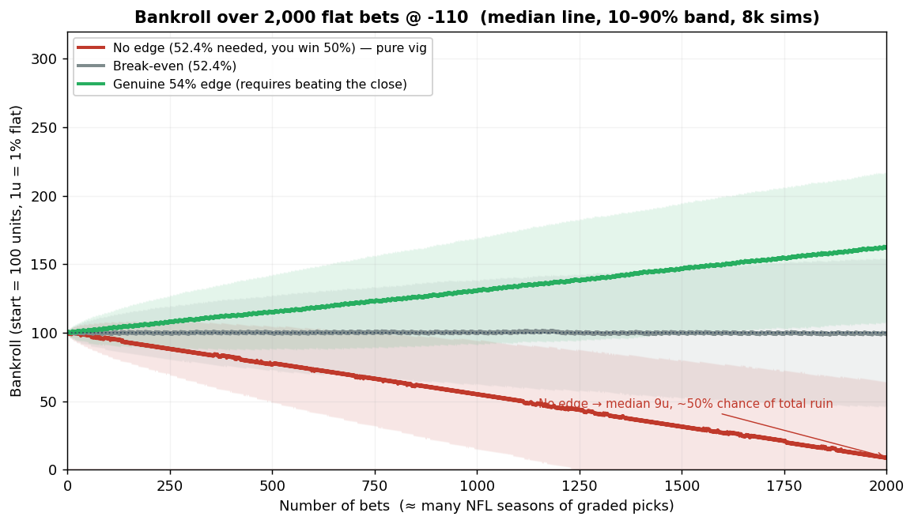
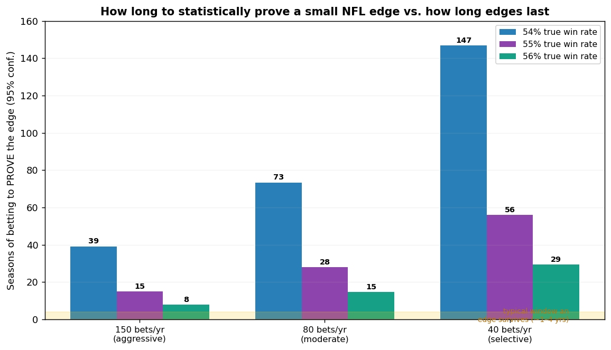

# Premortem — NFL Value Engine (RAG + ML + Discord plan)

*Adversarial review of `RAG_PIPELINE_PLAN.md`. Method: deep-research (5 source-verified
research streams) + red team + Monte Carlo bankroll simulation on the actual engine.
Framing: it is 12 months from now, the project shipped, and it failed. This is the autopsy —
then the fixes. Date: 2026-07-01.*

> This is decision-support and documented-fact research, **not** legal, financial, or
> gambling advice. Bet only what you can afford to lose. 1-800-GAMBLER.

---

## 0. Verdict (read this if nothing else)

The plan is **unusually honest** — it already concedes the model can't beat the close and
pins the "durable edge" on line-shopping soft prices + CLV + qualitative tags. That honesty
is the plan's best feature, and this premortem builds on it rather than dunking on it.

But the premortem finds a **fatal stack**: the one edge the plan believes in is (a) **not
legally accessible from Florida**, (b) **not testable with the data on disk**, and (c) **not
harvested by the Wednesday cadence the plan schedules** — while the thing the automation
*does* ship (post model signals >60% to Discord) is precisely the thing your own backtest
proves loses money. Layer on statistical un-provability, limit/ban self-destruct, and the
Kelly-overbet ruin trap, and the most likely 12-month outcome is: **a beautiful, well-engineered
pipeline that produces calibrated numbers, a Discord that slowly bleeds its followers' money,
and no way to tell whether any of it worked.**

The engineering is worth building. The **betting thesis is not funded by evidence.** The fix
is to change the scoreboard from "profit" to **CLV**, paper-trade, and start capturing the
multi-book/line-movement data you don't currently have — before a single real dollar is at risk.

**Your own walk-forward backtest, betting the model into closing lines:**

| Market | Bets | Win % | ROI | Units (100u start) |
|---|---|---|---|---|
| Spread | 761 | 49.2% | **−6.1%** | −45.5 |
| Total | 762 | 46.0% | **−12.2%** | −91.5 |
| Moneyline | 871 | 30.8% | **−14.8%** | −128.8 |
| **Combined** | | | | **100u → −165.7u (bankrupt)** |

ATS pick accuracy 48.8% (worse than a coin flip). Model margin-correlation 0.37 < closing-line
0.43. Every season a net loss. *Source: `data/backtest.json` in this repo.*

---

## 1. The most likely failure story (the premortem narrative)

You build Phases 1–4 (they're well-scoped and you'll finish them — you're a competent engineer).
The warehouse is clean, the EPA mismatch reports read beautifully, XGBoost calibrates nicely
(Brier ≈ 0.23, just like the Monte Carlo). Every Wednesday the bot posts 3–6 games at ">62%
confidence" to Discord with crisp reasons and tags. It feels like a real edge.

Three things quietly go wrong:

1. **You can't act on it the way the edge requires.** You live in Florida, where the only legal
   online book is Hard Rock Bet. There is no book to shop against, so the "line-shopping soft
   prices" edge — the entire durable-edge thesis — never exists in practice. If you route around
   that with offshore/out-of-state books, you're betting illegally *and* those are the books that
   limit winners fastest.
2. **You can't tell if it's working.** With ~40–150 graded bets a season and a (hypothetical)
   sub-3-point edge, it takes **8 to 40+ seasons** to distinguish skill from luck. Meanwhile the
   Discord reacts to variance: a hot month feels like proof, a cold month feels like a bug, and
   you "tune" the model — chasing noise.
3. **The scoreboard you chose is the wrong one.** You track weekly W/L (pure variance) instead of
   CLV (the only fast, valid skill signal). So you never get the one measurement that could have
   told you the truth in ~50 bets instead of ~5,000.

Twelve months in: real money is down (vig + variance), the Discord followers are down more, you've
over-fit the model to a season of noise, and — worst case — someone asks why a `ufl.edu`-affiliated
person is running a betting-tip channel. You shut it down, unsure if the idea was ever good. **It
was never tested, because it was never testable as built.**

---

## 2. Prioritized failure-mode register

Ranked by **severity = likelihood × impact.** "Fatal" = kills the core thesis; "High" = large
money/soundness hit; "Med" = real but survivable.

| # | Failure mode | Likelihood | Impact | Why it happens |
|---|---|---|---|---|
| **F1** | **Edge legally inaccessible from FL (one-book market)** | Certain (if FL) | **Fatal** | Line-shopping soft prices needs many books. Florida has exactly one legal online book (Hard Rock/Seminole, exclusive to 2051). No shopping → no edge. |
| **F2** | **The believed edge can't be backtested — data is closing-lines-only** | Certain | **Fatal (to validation)** | `historical_lines.parquet` holds closing lines only. You cannot measure "beat the soft/early price" or CLV historically. You'd deploy an unvalidated edge. |
| **F3** | **Model can't beat the close (proven)** | Certain | High | Your backtest: −6% to −15% ROI into closing numbers. The >60% Discord alert *is* "model vs close" — i.e., the losing signal. |
| **F4** | **Scalability self-destruct: soft books limit/ban winners** | High (if you win) | High | Books profile CLV in ~20 bets; ~58% of restricted UK accounts cut below 10% of max stake. Soft books limit fastest; sharp books (Pinnacle/Circa) don't, but their prices aren't soft. |
| **F5** | **Wednesday cadence misses the early/soft prices** | Certain (as designed) | High | Soft/early numbers get bet out within hours. Posting Wed = betting into near-closing, near-efficient lines — the worst moment for the stated edge. |
| **F6** | **Statistical un-provability within the edge's lifetime** | Certain | High | Need ~2,200 bets to prove a 55% edge, ~5,900 for 54%, ~40,000 for 53%. NFL yields ~40–150 quality bets/yr → 8–40+ seasons. Edges decay in 1–4. |
| **F7** | **Multiple comparisons + weekly "learning" → fake edges** | High | High | Ranking many mismatches and firing on the top ones mines noise. Online weight updates on ~15 games/week fit variance, not signal. |
| **F8** | **Kelly on an overestimated edge → ruin** | Med-High | **Fatal (bankroll)** | Kelly assumes *known* p. MC: believe 56%, true 51.5%, full Kelly → **77% chance of near-wipeout** in 1,000 bets. Overfit confidence is exactly this error. |
| **F9** | **Calibration mistaken for profitability** | Med | Med-High | A great Brier score means honest probabilities, **not** +EV vs the market. Easy to conflate "well-calibrated" with "profitable." |
| **F10** | **Legal/compliance: tout, affiliate, Discord ToS, offshore promotion** | Med (rises w/ monetization) | Med-High | FTC requires conspicuous affiliate disclosure even for *free* picks; Discord bans promoting illegal gambling / linking illegal books / monetized facilitation; steering FL users offshore is AG-enforced. |
| **F11** | **UF entanglement (ufl.edu resources / AUP / reputation / NCAA)** | Low-Med | Med (High if athlete/staff) | UF AUP bars using UF IT resources/email for "personal financial gain"; UF email is public record. NCAA 10.3 (incl. "providing information to bettors") applies **only if** you're a student-athlete or athletics staff. |
| **F12** | **Data/ops fragility** | Med | Med | The Odds API free tier = 500 credits/mo → stale snapshots; a snapshot price ≠ a bettable price; leakage risk in features; abbrev drift (OAK→LV); `nflreadpy` may be blocked in sandbox. |
| **F13** | **Behavioral / responsible-gambling risk from "weekly churn"** | Med | High (personal) | "Churning winning bets" weekly is the classic chase/tilt loop; a Discord adds social pressure to keep posting and keep betting through downswings. |
| **F14** | **Complexity/opportunity cost for a null edge** | High | Med | RAG + vector store + XGBoost + warehouse is a lot of surface area to maintain around an edge that may be zero. Effort ≠ edge. |

**The three that actually decide the project: F1, F2, F6.** If you can't access the edge, can't
test the edge, and can't prove the edge inside its lifetime, everything downstream is decoration.

---

## 3. Monte Carlo stress test

Standard −110 juice (break-even **52.38%**). 20,000 simulations per scenario; flat stake = 1 unit
= 1% of a 100-unit bankroll; ruin = bankroll touches 0. Full code + results:
`premortem_mc.py`, `premortem_mc_results.json`.

### 3.1 Bankroll trajectories — the vig is the default outcome

| True win rate | EV/bet | Bets | Median end | P(profit) | P(ruin) | P(down >50%) |
|---|---|---|---|---|---|---|
| 50.0% (no edge) | −4.55% | 500 | 77.3u | 15.4% | 0% | 9.9% |
| 50.0% (no edge) | −4.55% | 2000 | **9.1u** | 1.7% | **49.6%** | 83.2% |
| 52.38% (break-even) | 0.00% | 2000 | 98.8u | 49.9% | 2.0% | 12.2% |
| 53.0% | +1.18% | 2000 | 123.6u | 71.0% | 0.5% | 4.2% |
| 54.0% | +3.09% | 2000 | 161.8u | 92.8% | 0% | 0.5% |
| 55.0% | +5.00% | 2000 | 200.0u | 99.2% | 0% | 0% |

**Read:** with *no* edge — the honest baseline given your backtest — 2,000 bets leaves a median of
**9 units and a coin-flip chance of total ruin.** A real 54–55% edge is genuinely lucrative… but
reaching 54–55% means *beating the closing line*, which your backtest shows the model does not do.
The green line is the prize; nothing in the evidence says you can stand on it.

### 3.2 The Kelly trap — overconfidence is how +EV bettors still go broke

Proportional Kelly, outcomes drawn from the *true* rate, 1,000 bets. Ruin proxy = dip below 5% of start.

| Belief vs reality | Kelly | Stake/bet | Median end | P(profit) | P(near-wipeout) |
|---|---|---|---|---|---|
| Honest 54%, true 54% | half | 1.7% | 148u | 78.7% | 0.0% |
| Honest 54%, true 54% | **full** | 3.4% | 169u | 70.9% | 0.1% (but 32% chance of −50% drawdown) |
| **Think 56%, true 51.5%** | full | 7.6% | **2u** | 4.6% | **76.6%** |
| Think 56%, true 51.5% | half | 3.8% | 27u | 13.7% | 10.1% |
| Think 55%, true 52% | half | 2.75% | 58u | 25.6% | 0.3% (85.7% chance of −50%) |

**Read:** an over-fit model that *thinks* it's found a 56% edge when the truth is below break-even
**wipes you out ~77% of the time** at full Kelly. This is not a tail risk; it's the base case for a
noisy edge estimate. Use **quarter-to-half Kelly at most**, and never trust the point estimate.

### 3.3 Time to prove an edge vs. how long edges last

| True win rate | Edge over break-even | Bets to prove (95%, 80% power) |
|---|---|---|
| 53% | +0.62 pts | **40,225** |
| 54% | +1.62 pts | 5,875 |
| 55% | +2.62 pts | 2,243 |
| 56% | +3.62 pts | 1,173 |
| 57% | +4.62 pts | 719 |

Converted to seasons at realistic NFL volumes (your backtest fired ~150 spread bets/yr at a 3% EV
threshold — the "aggressive" row):

| Cadence | Prove 54% | Prove 55% | Prove 56% |
|---|---|---|---|
| ~150 bets/yr (aggressive) | 39 yrs | 15 yrs | 7.8 yrs |
| ~80 bets/yr (moderate) | 73 yrs | 28 yrs | 15 yrs |
| ~40 bets/yr (selective) | 147 yrs | 56 yrs | 29 yrs |

**Read:** by the time W/L records could confirm a small edge, the edge is long dead and the market
has re-priced. This is *the* argument for switching your success metric to **CLV**, which shows a
statistically significant signal in as few as ~50–65 bets (vs. thousands for profit) — because
CLV's per-bet noise (~0.1) is ~10× smaller than profit's (~1.0).

---

## 4. Red team — attacking the load-bearing assumptions

**"The edge is line-shopping soft prices."** In Florida you legally have **one** book. Even ignoring
geography, the books with soft prices (DraftKings, FanDuel, etc.) are recreational books that copy
sharp lines and defend themselves by **limiting the exact behavior you'd exhibit** — beating the
close, betting soft/early numbers. Operators said so on the record (BetMGM: limiting the "~1% of
advantage players" is what lets them offer competitive lines). A pro who consults for books: "*I can
identify 90% of winning players in the first 20 bets*" — by CLV, not by whether you're up. The books
that *don't* limit (Pinnacle, Circa) offer efficient prices with little soft edge and, for Circa,
in-person/in-state constraints. **The soft price and the tolerant book are mutually exclusive**, and
in FL both are moot.

**"We'll post >60% confidence signals weekly and churn winners."** Two problems. (1) ">60% to cover"
is a *model-vs-market* disagreement — your backtest priced that at −6% to −15% ROI. (2) A Wednesday
batch cannot capture an early/soft-price edge that evaporates in hours. You've scheduled the pipeline
for the moment the market is *most* efficient. The cadence and the thesis contradict each other.

**"XGBoost will find mismatches the market misses."** The market already prices the EPA story
(closing-line corr 0.43 > your model's 0.37 in your own test). Worse, ranking dozens of unit-vs-unit
mismatches and acting on the top few is a **multiple-comparisons machine**: with enough candidate
signals, some will look profitable by chance. The weekly online-learning step compounds this —
updating factor weights on ~15 games/week fits variance. Expect the model to look best right after
it has over-fit the most recent noise.

**"It's well-calibrated, so it's good."** Calibration and profitability are different scoreboards. A
perfectly calibrated model that agrees with the market makes zero money after vig. Your Brier ≈ 0.23
is real and honest — and irrelevant to whether you beat a price. Don't let a good calibration curve
launder a null edge into a bet.

**"We can validate before risking money."** Not with this data. Closing-lines-only means the historical
record literally cannot express "the price I could have gotten vs. the closing price." You can validate
*calibration* (done) but not *the edge* (impossible as-is). The plan's Phase 3 "honest scoreboard"
measures ROI **vs. close** — which, again, is the thing you already proved loses.

**"Free picks on Discord carry no legal risk."** Free removes the biggest risk (selling picks) but not
all of it. FTC requires conspicuous disclosure of affiliate links even on free content; Discord's own
policy prohibits promoting illegal gambling, linking illegal books, and monetized gambling facilitation;
and steering Florida users to offshore books is actively enforced by the FL AG (including pressure on
Visa/Mastercard). Nuance worth knowing: Florida's 2026 bills to *criminalize promoting* non-Seminole
betting **failed** this session (may return in 2027), so today's exposure is civil/AG/consumer-protection
and platform-ToS flavored, not a clean felony statute.

**"My UF email is fine to use."** Two separate things. NCAA Bylaw 10.3 — including its ban on
"providing information to individuals involved in sports wagering" and its prohibition on betting
**pro sports** — applies **only if you're a student-athlete or athletics-department staff.** If you're
an ordinary student, NCAA rules don't reach you. But UF's Acceptable Use Policy *does*: UF IT resources
and your `ufl.edu` address may not be used "for personal financial or other gain," and UF email is a
public record. Keep the venture 100% off UF resources, name, and email regardless.

**"Weekly churn is just discipline."** "Churning winning bets" every week is structurally a chase loop;
a public Discord adds pressure to keep posting and keep betting through downswings, which is exactly how
disciplined bankroll plans die. Design against your future self, not just the market.

---

## 5. What would have to be true for this to actually work

A fair steelman — the narrow path exists, it's just narrow:

1. **You bet where you can legally shop** (not FL-restricted), across ≥5 books, and bet **early** when
   soft numbers exist — not on a Wednesday batch.
2. **You measure CLV, not W/L**, and you actually beat the no-vig close by a real margin over 100+ logged bets.
3. **You capture line-movement data going forward** (opening→closing, multi-book) so the edge becomes
   testable — the data you'd need starts accruing the day you start logging it.
4. **You stay small and unlimited** — recreational stakes under the radar, accepting the edge doesn't
   scale, or graduate to beating efficient books (a much higher bar).
5. **You keep it a hobby/《research》 tool, unmonetized, off UF resources,** and size with fractional Kelly.

If most of those aren't true, you have a calibrated projection toy and an entertainment Discord — which
is fine, but it is not a money machine, and the plan should say so in the header.

---

## 6. De-risking recommendations (do these in order)

1. **Change the scoreboard to CLV. (Highest-leverage single change.)** Add a `clv` table: for every
   would-be bet, log the price/number you *could* get at decision time and the eventual no-vig closing
   number. Track average CLV, not weekly profit. It gives a valid skill read in ~50–65 bets instead of
   thousands. **Kill criterion: if average CLV ≤ 0 after 150 logged bets, the edge isn't there — stop.**
2. **Paper-trade only until CLV is proven.** No real money until (1) clears. This costs nothing and
   removes F3/F8/F13 entirely during the test phase.
3. **Start capturing the data you don't have.** Snapshot multi-book lines from opening through close
   into the `lines` table now (the schema already anticipates this). Without it, F2 is permanent.
4. **Fix the cadence–thesis contradiction.** If the edge is early/soft prices, the pipeline must run
   when lines *open* (or continuously), not Wednesday. If you keep Wednesday, drop the "beat the market"
   claim and market it as calibrated projections only.
5. **Confront the Florida constraint explicitly.** With one legal book, line-shopping is off the table;
   decide the project's purpose accordingly. Do not route to offshore books.
6. **Size with quarter-to-half Kelly, hard-capped**, computed on a *shrunk* edge estimate. Never full
   Kelly; never trust the point estimate (see §3.2).
7. **Harden the stats:** freeze the model, evaluate strictly out-of-sample, correct for the number of
   signals you screen, and report CLV + calibration + profit as **three separate** scoreboards.
8. **Compliance hygiene (if it ever goes public):** don't monetize; if any affiliate link ever appears,
   disclose it conspicuously; keep it off `ufl.edu` email/resources and the UF brand; if you are a
   student-athlete or athletics staff, **do not run it at all.** (Not legal advice — confirm with counsel
   before monetizing.)
9. **Right-size the build.** Ship Phases 1–2 (warehouse + mismatch report) as a research/calibration tool.
   Gate Phases 3–5 (ML, RAG, automation, Discord) behind a *proven positive CLV*. Don't automate a null.
10. **Responsible-gambling guardrails:** fixed monthly loss cap you cannot override, no chasing rule,
    and treat "must post this week" as a red flag, not a duty. 1-800-GAMBLER.

---

## 7. Confidence & limitations of this premortem

- **High confidence:** market-efficiency/CLV findings, the −110 break-even and sample-size math, the
  MC results (reproducible via the included script), the closing-lines-only data gap, and your own
  backtest numbers.
- **Medium confidence:** exact limit magnitudes/timelines (UK-regulator data is the best primary
  source but is a UK market), "3–5% of bettors win" (industry consensus, not one audited study), and
  the precise legal exposure of a *free* pick service (genuinely unsettled).
- **Depends on facts I assumed:** that you'd bet as a **Florida resident** and are an **ordinary UF
  student** (not athlete/athletics staff). If either is wrong, F1 and F11 change materially — tell me
  and I'll revise.
- **Not covered:** a full legal opinion (get counsel before monetizing) and props-specific modeling
  (props are lower-liquidity, where CLV is *not* a valid edge proxy — treat any prop signals with extra
  suspicion).

---

## 8. Sources

**Market efficiency & CLV** — Levitt, *Why are gambling markets organised so differently?* (pricetheory.uchicago.edu/levitt/Papers/LevittWhyAreGamblingMarkets2004.pdf); Buchdahl on CLV↔yield & the ~50-bet signal (pinnacleoddsdropper.com/blog/closing-line-value--clv-demystified-by-expert-joseph-buchdahl; football-data.co.uk/blog/pinnacle_efficiency.php); Action Network, *Closing Line Value* (actionnetwork.com); Unabated, *Getting precise about CLV* (unabated.com/articles/getting-precise-about-closing-line-value); Brown, Grasley & Guido 2025, avg bettor loses 7.5¢/$ (papers.ssrn.com/sol3/papers.cfm?abstract_id=5191510).

**Limits & bans** — ESPN, sportsbooks defend limiting sharps (espn.com/sports-betting/story/_/id/41231266); UK Gambling Commission, commercial restrictions data (gamblingcommission.gov.uk/blog/post/commercial-restrictions-by-betting-operators); How Gambling Works, *The Truth About Limits* (howgamblingworks.substack.com/p/the-truth-about-limits); Establish The Run, *A Discussion About Limits* (establishtherun.com/a-discussion-about-limits-in-sports-betting/); Pinnacle, sharp vs recreational models (pinnacle.com).

**Vig, sample size, Kelly, ruin** — Boyd's Bets break-even (boydsbets.com/percentage-bets-break-even/); nfelo hold calculator (nfeloapp.com/tools/sportsbook-hold-calculator/); Sports Insights, statistical significance / ~2,000-bet figure (sportsinsights.com/sports-investing-statistical-significance/); Kelly criterion (en.wikipedia.org/wiki/Kelly_criterion); Wharton, *Betting with Kelly* (wsb.wharton.upenn.edu/wp-content/uploads/2023/05/Beggy_2023__Betting_Kelly.pdf); NFL 272-game schedule (en.wikipedia.org/wiki/NFL_regular_season).

**Tout / legal / Florida** — FTC Endorsement Guides FAQ (ftc.gov/business-guidance/resources/ftcs-endorsement-guides-what-people-are-asking); SportsHandle on touts (sportshandle.com/buyer-beware-sports-betting-touts/); Discord Gambling Policy (discord.com/safety/gambling-policy-explainer) & Monetization Policy (support.discord.com/hc/en-us/articles/10575066024983); Legal Sports Report — Florida (legalsportsreport.com/sports-betting/states/florida/); Holland & Knight on West Flagler/SCOTUS (hklaw.com); PlayUSA, FL 2026 gambling bills failed (playusa.com/news/florida-stumbles-at-the-finish-line-on-illegal-gambling-bills/); FL AG offshore enforcement (deadspin.com/legal-betting/florida-targets-visa-mastercard-over-offshore-sportsbook-payments/).

**NCAA & UF** — NCAA, DI keeps pro-betting ban (ncaa.org/news/2025/11/21/); NCAA Bylaw 10.3 text (Tulsa brochure); NCAA Bohannon "providing information" case (ncaa.org/news/2024/2/1/); UF Acceptable Use Policy 12-002 (policy.ufl.edu/policy/acceptable-use-policy/); UF athletics compliance — gambling (floridagators.com); American Gaming Association ends university betting deals (actionnetwork.com).

**Internal** — this repo: `data/backtest.json`, `RAG_PIPELINE_PLAN.md`, `README.md`, `backtest.py`,
`nflvalue/montecarlo.py`, `nflvalue/oddsmath.py`. Monte Carlo: `premortem_mc.py`, `premortem_mc_results.json`.
